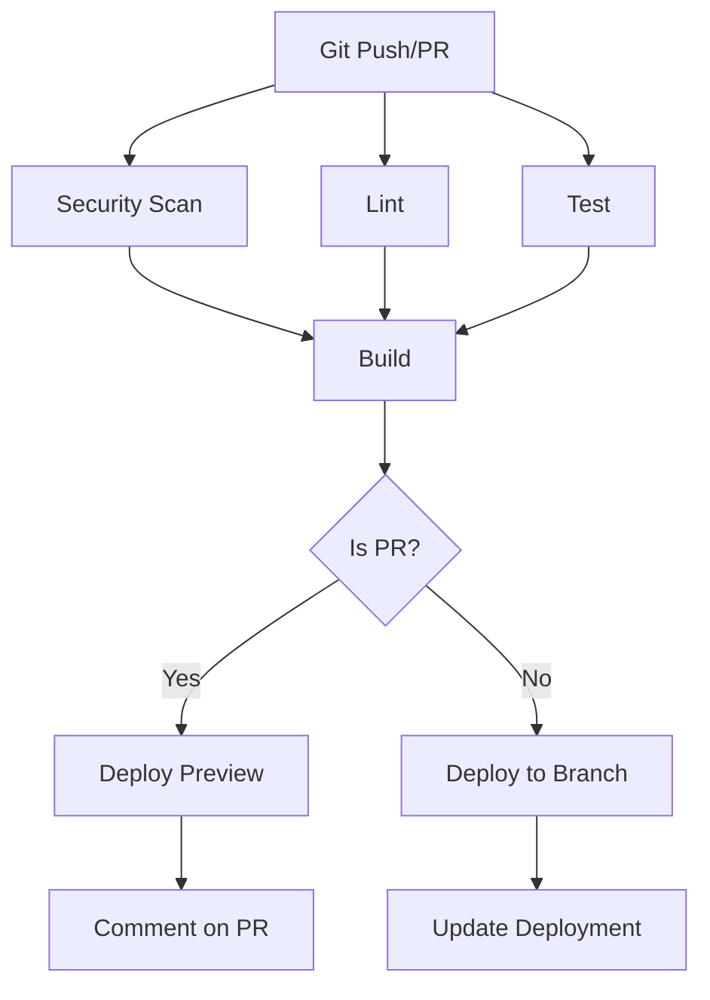

# CI/CD Pipeline Documentation

This document describes the Continuous Integration and Continuous Deployment (CI/CD) pipeline for the Hidden Key Investments platform.

## Table of Contents

1. [Overview](#overview)
2. [Pipeline Architecture](#pipeline-architecture)
3. [CI Jobs](#ci-jobs)
4. [Deployment Flow](#deployment-flow)
5. [Security Scanning](#security-scanning)
6. [Test Coverage](#test-coverage)
7. [Troubleshooting](#troubleshooting)

---

## Overview

The CI/CD pipeline automatically:
- ✅ Scans for security vulnerabilities
- ✅ Lints code for quality
- ✅ Runs unit and integration tests
- ✅ Builds the application
- ✅ Deploys to Netlify
- ✅ Reports test coverage

**Trigger Events**:
- Push to `main`, `staging`, or protected branches
- Pull requests to `main` or `staging`

**Duration**: ~5-7 minutes per run

---

## Pipeline Architecture



### Jobs Overview

| Job | Purpose | Duration | Runs On |
|-----|---------|----------|---------|
| `security-scan` | Security & secret scanning | ~2 min | All commits |
| `lint` | Code quality checks | ~1 min | All commits |
| `test` | Unit & integration tests | ~2 min | All commits |
| `build` | Build verification | ~1 min | After lint & test |
| `deploy-preview` | PR preview deployment | ~30 sec | PRs only |

---

## CI Jobs

### 1. Security Scan

**Purpose**: Detect vulnerabilities and secrets before they reach production

**Tools Used**:
- **Trivy**: File system vulnerability scanner
- **Gitleaks**: Secret scanner
- **TruffleHog**: Secret scanner with verification

**Configuration**:
```yaml
security-scan:
  name: Security Scan
  runs-on: ubuntu-latest
  permissions:
    contents: read
    security-events: write
  steps:
    - name: Run Trivy vulnerability scanner
      uses: aquasecurity/trivy-action@master
      with:
        scan-type: 'fs'
        severity: 'CRITICAL,HIGH'
        
    - name: Run Gitleaks secret scanner
      uses: gitleaks/gitleaks-action@v2
      
    - name: Run TruffleHog secret scanner
      uses: trufflesecurity/trufflehog@main
```

**What It Checks**:
- ✅ Dependency vulnerabilities (npm packages)
- ✅ Exposed secrets (API keys, tokens)
- ✅ Security misconfigurations
- ✅ Known CVEs in dependencies

**Results**: Uploaded to GitHub Security tab

### 2. Lint

**Purpose**: Enforce code quality and style consistency

**What It Does**:
```yaml
lint:
  steps:
    - name: Validate environment
      run: bash scripts/validate-env.sh
      
    - name: Install dependencies
      run: npm ci
      
    - name: Validate package dependencies
      run: npm audit --audit-level=high
      
    - name: Run ESLint
      run: npm run lint
```

**Checks**:
- ✅ ESLint rules (TypeScript, React, React Hooks)
- ✅ Code style consistency
- ✅ Unused variables (warnings only for underscore-prefixed)
- ✅ npm package vulnerabilities

**Linting Rules**:
- Errors: Block CI (must fix)
- Warnings: Don't block CI (should fix)

**Current Status**: 0 errors, 210 warnings (all non-critical)

### 3. Test

**Purpose**: Verify functionality with automated tests

**What It Does**:
```yaml
test:
  steps:
    - name: Run unit tests with coverage
      run: npm run test:coverage
      
    - name: Run function tests
      run: npm run test:functions
      
    - name: Upload coverage to Codecov
      uses: codecov/codecov-action@v4
```

**Test Suites**:

| Suite | Tests | Purpose |
|-------|-------|---------|
| Main Tests | 19 | React components, utilities, validation |
| Function Tests | 82 | Serverless API endpoints |
| **Total** | **101** | Full application coverage |

**Coverage Targets**:
- Lines: 60%
- Functions: 60%
- Branches: 60%
- Statements: 60%

**Test Reports**:
- GitHub Actions summary
- Codecov dashboard
- Coverage artifacts (7-day retention)

### 4. Build

**Purpose**: Verify the application builds successfully

**What It Does**:
```yaml
build:
  needs: [lint, test]
  steps:
    - name: Install dependencies
      run: npm ci
      
    - name: Validate environment configuration
      run: |
        if [ ! -f .env.example ]; then
          echo "::warning::.env.example file not found"
        fi
        
    - name: Build project
      run: npm run build
      
    - name: Upload build artifacts
      uses: actions/upload-artifact@v4
```

**Build Output**:
- `dist/` directory with production assets
- Optimized and minified JavaScript
- CSS with PostCSS transformations
- Static HTML with injected scripts

**Artifacts**: Uploaded to GitHub Actions (7-day retention)

### 5. Deploy Preview

**Purpose**: Provide preview URLs for pull requests

**What It Does**:
```yaml
deploy-preview:
  if: github.event_name == 'pull_request'
  needs: [build, security-scan]
  steps:
    - name: Comment PR with deployment info
      uses: actions/github-script@v7
```

**PR Comment Includes**:
- ✅ Deployment status
- ✅ Test results summary
- ✅ Build status
- ✅ Link to Netlify preview (added by Netlify bot)

---

## Deployment Flow

### Automatic Deployments

| Branch | Deploy To | URL Pattern |
|--------|-----------|-------------|
| `main` | Production | `hidden-key-investments.netlify.app` |
| `staging` | Staging | `staging--hidden-key-investments.netlify.app` |
| Feature branches | Branch preview | `[branch]--hidden-key-investments.netlify.app` |
| PRs | Deploy preview | `deploy-preview-[pr]--hidden-key-investments.netlify.app` |

### Deployment Process

```bash
# 1. Developer pushes code
git push origin feature/new-feature

# 2. GitHub Actions runs CI pipeline
# - Security scan
# - Lint
# - Test
# - Build

# 3. If CI passes, Netlify deploys
# - Builds in Netlify's environment
# - Runs build command
# - Deploys to CDN

# 4. Deployment complete
# - Preview URL available
# - PR comment added
```

### Branch-Specific Configuration

**Production** (`main` branch):
```toml
[context.production]
  environment = { NODE_ENV = "production" }
```
- Full error tracking
- Production API keys
- Optimized builds
- Caching enabled

**Staging** (`staging` branch):
```toml
[context.staging]
  environment = { NODE_ENV = "staging" }
```
- Test API keys
- Staging database
- Full error tracking
- Safe for testing

**Feature Branches**:
```toml
[context.branch-deploy]
  environment = { NODE_ENV = "development" }
```
- Development mode
- Quick builds
- Preview functionality

---

## Security Scanning

### Trivy - Vulnerability Scanner

**What It Scans**:
- npm dependencies
- File system vulnerabilities
- Misconfigurations

**Severity Levels**:
- CRITICAL: Must fix immediately
- HIGH: Should fix soon
- MEDIUM/LOW: Consider fixing

**Example Output**:
```
Total: 0 (CRITICAL: 0, HIGH: 0)
✅ No vulnerabilities found
```

### Gitleaks - Secret Scanner

**What It Detects**:
- API keys
- Access tokens
- Passwords
- Private keys
- Database credentials

**Rules**: 
- Custom patterns for common secrets
- Historical commit scanning
- Pre-commit prevention (if configured)

**Example Output**:
```
✅ No secrets found
```

### TruffleHog - Secret Verification

**What It Does**:
- Scans for secrets like Gitleaks
- Verifies secrets are valid (calls APIs)
- Reduces false positives

**Mode**: Debug with verification only

---

## Test Coverage

### Coverage Reports

**Generated Reports**:
1. **Text**: Console output during CI
2. **JSON**: Machine-readable data
3. **HTML**: Interactive web report
4. **LCOV**: Codecov integration

**Viewing Coverage**:

**In CI**:
```bash
# Check GitHub Actions logs
# Step: "Run unit tests with coverage"
```

**Locally**:
```bash
# Generate and view coverage
npm run test:coverage
open coverage/index.html
```

**On Codecov**:
1. Go to [codecov.io](https://codecov.io)
2. Find repository
3. View coverage trends

### Coverage Thresholds

**Current Configuration**:
```javascript
coverage: {
  lines: 60,
  functions: 60,
  branches: 60,
  statements: 60
}
```

**Files Excluded from Coverage**:
- `node_modules/`
- `dist/`
- `*.config.*` (configuration files)
- `*.test.*` (test files)
- `src/components/ui/` (shadcn/ui components)
- `netlify/functions/__tests__/`

---

## Troubleshooting

### CI Fails: Security Scan

**Issue**: Vulnerabilities detected

**Solution**:
```bash
# Check npm audit
npm audit

# Fix automatically
npm audit fix

# Fix breaking changes
npm audit fix --force

# Update specific package
npm update [package-name]
```

### CI Fails: Lint

**Issue**: ESLint errors

**Solution**:
```bash
# Run lint locally
npm run lint

# Auto-fix issues
npm run lint:fix

# Check specific file
npx eslint [file-path]
```

### CI Fails: Tests

**Issue**: Test failures

**Solution**:
```bash
# Run tests locally
npm test

# Run specific test
npm test -- [test-file]

# Run with watch mode
npm run test:watch

# Debug test
node --inspect-brk node_modules/.bin/vitest
```

### CI Fails: Build

**Issue**: Build errors

**Solution**:
```bash
# Clean install
rm -rf node_modules package-lock.json
npm install

# Run build
npm run build

# Check for TypeScript errors
npx tsc --noEmit
```

### Deployment Fails

**Issue**: Netlify deployment errors

**Check**:
1. Netlify build logs
2. Environment variables
3. Build command configuration

**Solution**:
```bash
# Test build locally with Netlify CLI
npx netlify build

# Deploy manually
npx netlify deploy --build --prod
```

### Tests Pass Locally But Fail in CI

**Possible Causes**:
1. Environment variables missing
2. Different Node version
3. OS-specific issues
4. Timing issues

**Solution**:
```bash
# Match CI Node version
nvm use 22

# Run tests with CI environment
CI=true npm test

# Check environment
node --version
npm --version
```

---

## Monitoring CI/CD

### GitHub Actions Dashboard

**View Workflows**:
1. Go to repository → **Actions** tab
2. Select workflow run
3. View job details

**What to Monitor**:
- ✅ Success rate (should be >95%)
- ✅ Duration (should be <7 minutes)
- ✅ Failed jobs (investigate immediately)

### Codecov Dashboard

**View Coverage**:
1. Go to [codecov.io](https://codecov.io)
2. Find repository
3. View trends

**What to Monitor**:
- Coverage % (target: >60%)
- Coverage changes in PRs
- Untested files

### Netlify Dashboard

**View Deployments**:
1. Go to [app.netlify.com](https://app.netlify.com)
2. Select site
3. View **Deploys** tab

**What to Monitor**:
- Deploy success rate
- Build time
- Deploy preview status

---

## Optimization Tips

### Faster CI Runs

1. **Cache Dependencies**:
```yaml
- uses: actions/setup-node@v4
  with:
    cache: 'npm'  # ✅ Already configured
```

2. **Parallel Jobs**:
```yaml
jobs:
  lint:    # Runs in parallel with test
  test:    # Runs in parallel with lint
  build:
    needs: [lint, test]  # Waits for both
```

3. **Skip CI** (use sparingly):
```bash
git commit -m "docs: update README [skip ci]"
```

### Better Test Performance

1. **Run Tests in Parallel**:
```javascript
// vitest.config.ts
export default defineConfig({
  test: {
    pool: 'threads',
    poolOptions: {
      threads: { maxThreads: 4 }
    }
  }
})
```

2. **Optimize Coverage**:
```javascript
coverage: {
  provider: 'v8',  // Faster than c8
  reporter: ['text', 'json'],  // Only what's needed
}
```

---

## Best Practices

### For Developers

✅ **DO**:
- Run `npm test` before pushing
- Run `npm run lint:fix` to auto-fix issues
- Check CI status before requesting review
- Write tests for new features
- Keep coverage above 60%

❌ **DON'T**:
- Force push to protected branches
- Skip tests with `.only()` or `skip()`
- Commit with `[skip ci]` for code changes
- Ignore linting warnings
- Leave failing tests

### For Reviewers

✅ **DO**:
- Check CI passes before reviewing
- Verify coverage doesn't decrease
- Test deploy preview
- Check for security warnings

❌ **DON'T**:
- Approve failing CI
- Ignore coverage drops
- Skip manual testing

---

## Quick Reference

### Common Commands

```bash
# Run full CI locally
npm ci
npm run lint
npm test
npm run build

# Fix issues
npm run lint:fix
npm audit fix

# Check coverage
npm run test:coverage

# View CI logs
gh run view [run-id]  # GitHub CLI
```

### Status Badges

Add to README.md:

```markdown


```

---

## Next Steps

1. ✅ Understand CI/CD pipeline
2. ✅ Monitor workflows regularly
3. ✅ Keep dependencies updated
4. ✅ Maintain test coverage >60%
5. ✅ Address security warnings promptly

See also:
- [ENVIRONMENT-SETUP.md](ENVIRONMENT-SETUP.md) - Environment configuration
- [STAGING-SETUP.md](STAGING-SETUP.md) - Staging environment
- [README.md](../README.md) - Project overview
