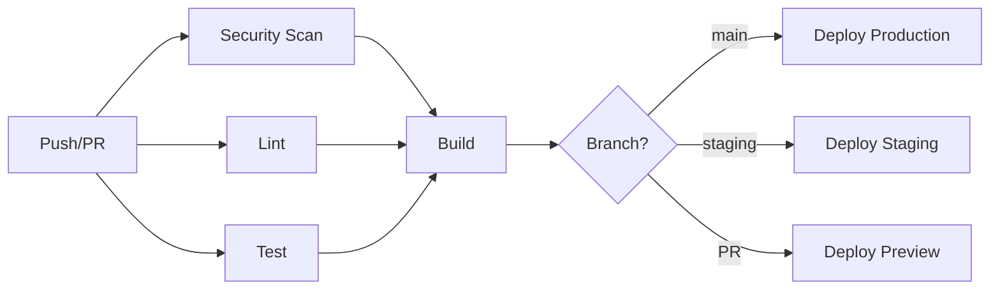

# CI/CD Pipeline Documentation

## Overview

The Hidden Key Investments platform uses GitHub Actions for continuous integration and deployment. The pipeline ensures code quality, security, and automated deployment across all environments.

## Pipeline Architecture



## Workflow File

Location: `.github/workflows/ci.yml`

## Jobs

### 1. Security Scan

**Purpose**: Scan for vulnerabilities in dependencies and code

**Tools**:
- **Trivy**: Scans filesystem for known vulnerabilities
- **SARIF Upload**: Results uploaded to GitHub Security tab

**Configuration**:
```yaml
severity: 'CRITICAL,HIGH'
exit-code: '0'  # Don't fail build on vulnerabilities
```

**When it runs**: On all pushes and PRs

**Permissions needed**:
- `contents: read`
- `security-events: write`

### 2. Lint

**Purpose**: Enforce code quality and style standards

**Tools**:
- **ESLint 9**: JavaScript/TypeScript linting

**Configuration**:
- Config file: `eslint.config.js`
- Runs on: `.ts`, `.tsx`, `.js`, `.jsx` files

**Exit codes**:
- 0: No errors (warnings allowed)
- Non-zero: Linting errors found

**When it runs**: On all pushes and PRs

**Permissions needed**:
- `contents: read`

### 3. Test

**Purpose**: Run unit tests and generate coverage reports

**Tools**:
- **Vitest**: Fast unit test runner
- **Coverage**: v8 provider for code coverage
- **Codecov**: Coverage reporting and tracking

**Configuration**:
```bash
npm run test:coverage  # Run tests with coverage
```

**Coverage Thresholds**:
- Lines: 60%
- Functions: 60%
- Branches: 60%
- Statements: 60%

**Outputs**:
- Coverage reports uploaded to Codecov
- Coverage artifacts retained for 7 days

**When it runs**: On all pushes and PRs

**Permissions needed**:
- `contents: read`

### 4. Build

**Purpose**: Compile and bundle the application

**Tools**:
- **Vite**: Frontend build tool
- **TypeScript**: Type checking

**Configuration**:
```bash
npm run build  # Builds to /dist
```

**Build time**: ~7 seconds (target: <10s)

**Outputs**:
- Build artifacts uploaded for 7 days
- Used for deployment

**When it runs**: After lint and test pass

**Dependencies**: Requires lint and test to succeed

**Permissions needed**:
- `contents: read`

### 5. Deploy Preview

**Purpose**: Create preview deployments for PRs

**Tools**:
- **Netlify**: Automatic PR previews

**Configuration**:
- Netlify handles deployment automatically
- GitHub Action adds comment with preview URL

**When it runs**: On pull requests only

**Permissions needed**:
- `contents: read`
- `pull-requests: write`

## Environment Variables

### GitHub Secrets (Required)

Set in: Repository → Settings → Secrets and variables → Actions

```bash
CODECOV_TOKEN         # Optional: For coverage reporting
```

### Netlify Environment Variables (Required)

Set in: Netlify Dashboard → Site settings → Environment variables

```bash
# Database
SUPABASE_URL
SUPABASE_SERVICE_ROLE_KEY
VITE_SUPABASE_URL
VITE_SUPABASE_ANON_KEY

# Email/SMS
MAILCHIMP_API_KEY
MAILCHIMP_SERVER_PREFIX
MAILCHIMP_LIST_ID

# Monitoring
VITE_SENTRY_DSN
VITE_APP_VERSION

# Feature Flags
VITE_FEATURE_*  # Various feature flags
```

## Workflow Triggers

### Push Events
```yaml
branches: 
  - main          # Production deploys
  - staging       # Staging deploys
  - cleanup/*     # Cleanup branches
  - backup/**     # Backup branches
```

### Pull Request Events
```yaml
branches:
  - main          # PRs to main
  - staging       # PRs to staging
```

## Performance Metrics

| Job | Average Duration | Target |
|-----|------------------|--------|
| Security Scan | 45s | <60s |
| Lint | 20s | <30s |
| Test | 35s | <60s |
| Build | 7s | <10s |
| **Total** | **~2 min** | **<3 min** |

## Failure Handling

### Lint Failures
- **Cause**: Code style violations
- **Fix**: Run `npm run lint:fix` locally
- **Prevention**: Use pre-commit hooks

### Test Failures
- **Cause**: Broken functionality
- **Fix**: Fix failing tests locally
- **Prevention**: Run tests before pushing

### Build Failures
- **Cause**: TypeScript errors, missing dependencies
- **Fix**: Run `npm run build` locally
- **Prevention**: Ensure clean builds locally

### Security Scan Failures
- **Cause**: Critical/high vulnerabilities
- **Action**: Review Trivy report in Security tab
- **Note**: Currently set to not fail builds (exit-code: 0)

## Local Testing

Before pushing, run these commands:

```bash
# Install dependencies
npm install

# Run linting
npm run lint

# Fix linting issues
npm run lint:fix

# Run tests
npm test

# Run tests with coverage
npm run test:coverage

# Build application
npm run build

# Test functions locally (requires Supabase)
npm run test:functions
```

## Deployment Environments

### Production (main branch)
- **URL**: https://hidden-key-investments.netlify.app
- **Database**: Production Supabase
- **Auto-deploy**: ✅ On merge to main
- **Environment**: `NODE_ENV=production`

### Staging (staging branch)
- **URL**: https://staging--hidden-key-investments.netlify.app
- **Database**: Staging Supabase
- **Auto-deploy**: ✅ On merge to staging
- **Environment**: `NODE_ENV=staging`

### Preview (pull requests)
- **URL**: https://deploy-preview-{pr-number}--hidden-key-investments.netlify.app
- **Database**: Staging Supabase (shared)
- **Auto-deploy**: ✅ On PR creation/update
- **Environment**: `NODE_ENV=preview`

## Branch Protection Rules

### main branch
- ✅ Require PR before merging
- ✅ Require status checks to pass
  - lint
  - test
  - build
  - security-scan
- ✅ Require conversation resolution
- ✅ Require linear history
- ❌ Require approvals (optional)

### staging branch
- ✅ Require PR before merging
- ✅ Require status checks to pass
- ❌ Require approvals (optional for rapid iteration)

## Monitoring & Alerts

### GitHub Actions
- **Failed workflows**: GitHub sends email notifications
- **View**: Actions tab in repository

### Codecov
- **Coverage trends**: https://codecov.io/gh/chad-prog/hidden-key-investments
- **Alerts**: Email on coverage drops

### Netlify
- **Deploy status**: https://app.netlify.com
- **Alerts**: Email on deploy failures

## Troubleshooting

### "npm ci" fails
```bash
# Delete package-lock.json and node_modules
rm -rf node_modules package-lock.json
npm install
git add package-lock.json
git commit -m "fix: regenerate package-lock.json"
```

### Coverage report not uploading
```bash
# Check CODECOV_TOKEN is set
# Verify coverage files exist in ./coverage/
# Check Codecov dashboard for errors
```

### Trivy scan timeout
```bash
# Trivy can be slow on first run
# Re-run the workflow
# If persists, check Trivy GitHub Action issues
```

### Netlify deploy fails
```bash
# Check build logs in Netlify dashboard
# Verify environment variables are set
# Ensure dist/ folder is created by build
```

## Best Practices

### Commit Messages
Follow conventional commits:
```bash
feat: add new feature
fix: resolve bug
docs: update documentation
chore: maintenance tasks
test: add tests
ci: update CI/CD
```

### Pull Requests
- Keep PRs small and focused
- Write clear descriptions
- Link related issues
- Ensure CI passes before requesting review
- Respond to review comments promptly

### Testing
- Write tests for new features
- Maintain test coverage >60%
- Test edge cases and error conditions
- Mock external dependencies

### Security
- Never commit secrets
- Use environment variables
- Keep dependencies updated
- Review security scan results
- Rotate secrets regularly

## Future Enhancements

- [ ] Add E2E tests with Playwright
- [ ] Implement performance budgets
- [ ] Add visual regression testing
- [ ] Set up staging database auto-restore
- [ ] Add deployment smoke tests
- [ ] Implement canary deployments
- [ ] Add bundle size tracking
- [ ] Set up dependency update automation (Dependabot)

## Resources

- [GitHub Actions Documentation](https://docs.github.com/en/actions)
- [Netlify Deploy Documentation](https://docs.netlify.com/)
- [Vitest Documentation](https://vitest.dev/)
- [ESLint Documentation](https://eslint.org/)
- [Codecov Documentation](https://docs.codecov.com/)
- [Trivy Documentation](https://aquasecurity.github.io/trivy/)

## Support

- **CI/CD Issues**: Create issue with `ci` label
- **Deployment Issues**: Check Netlify dashboard first
- **Security Alerts**: Review GitHub Security tab
- **Questions**: Tag `@devops-team` in discussions

---

**Last Updated**: 2025-10-27  
**Document Owner**: DevOps Team  
**Status**: Active
